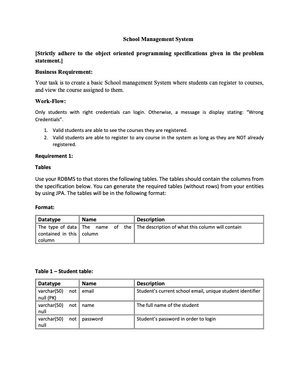
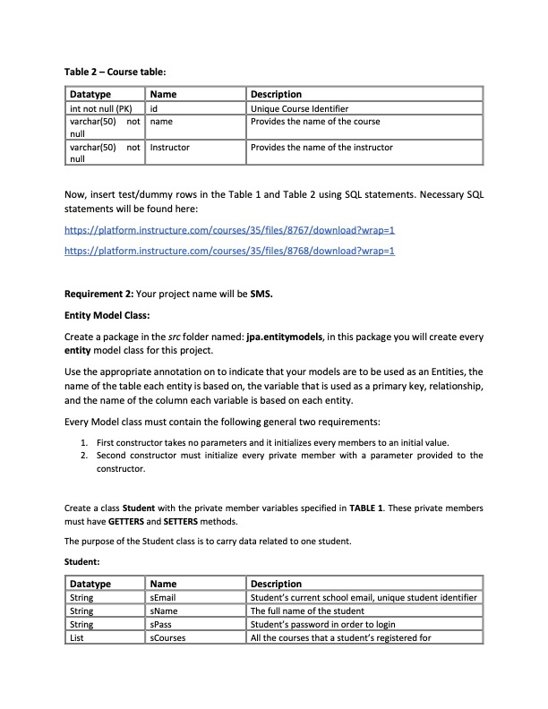
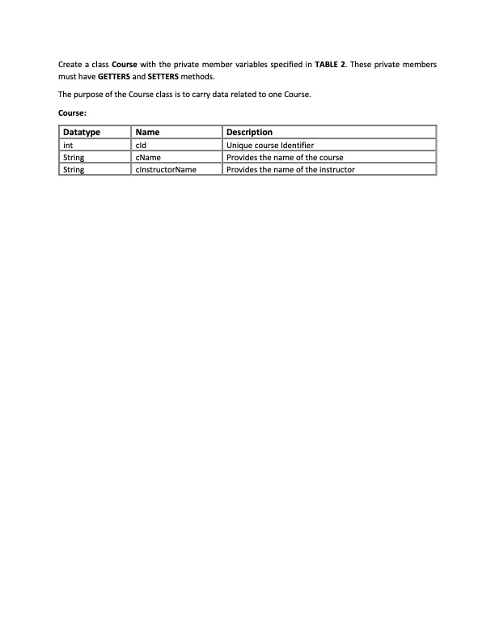
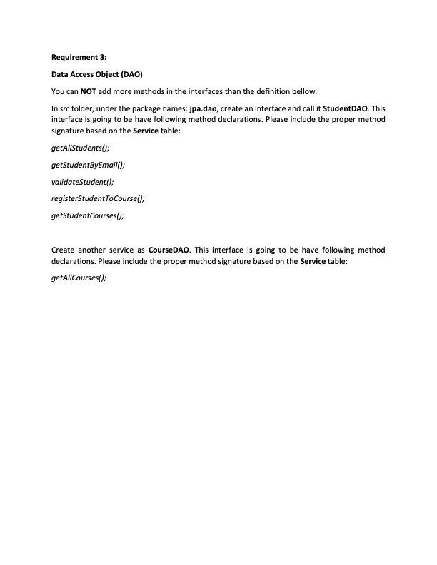
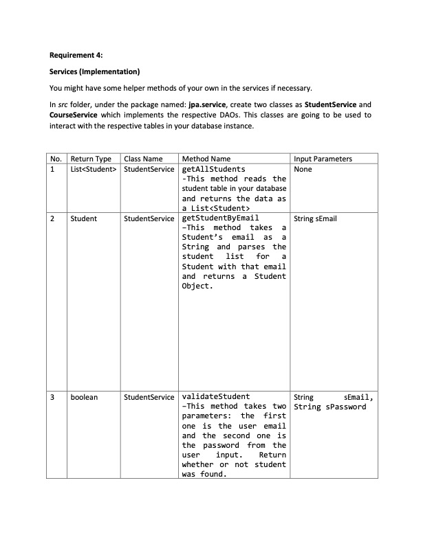
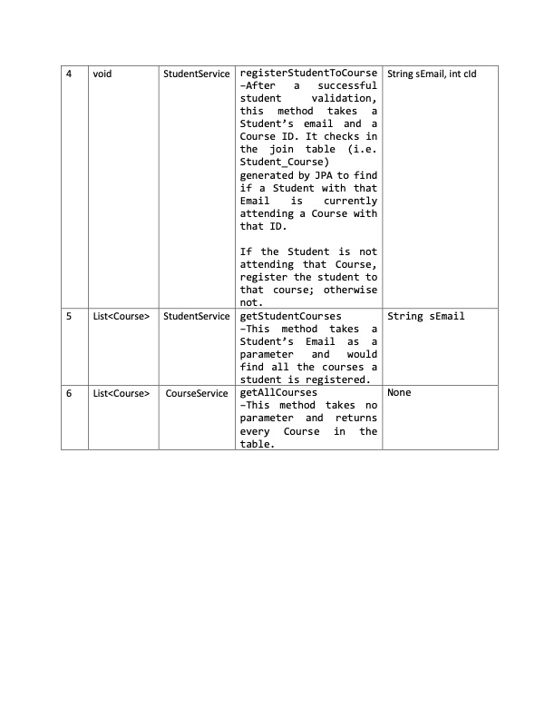
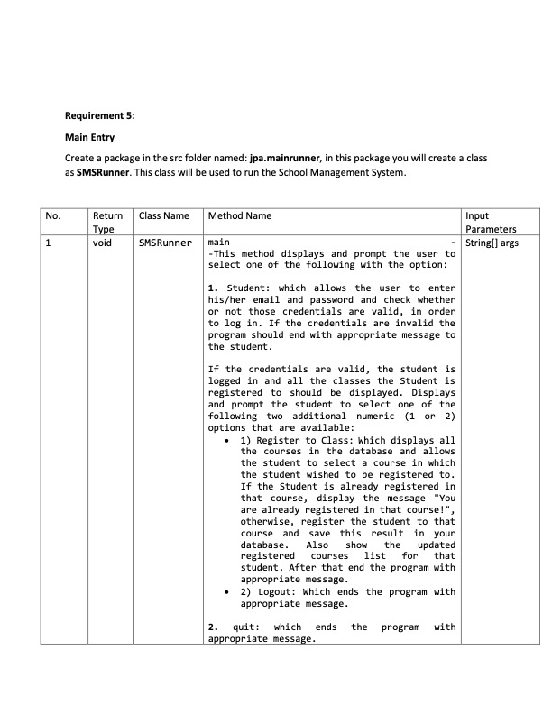
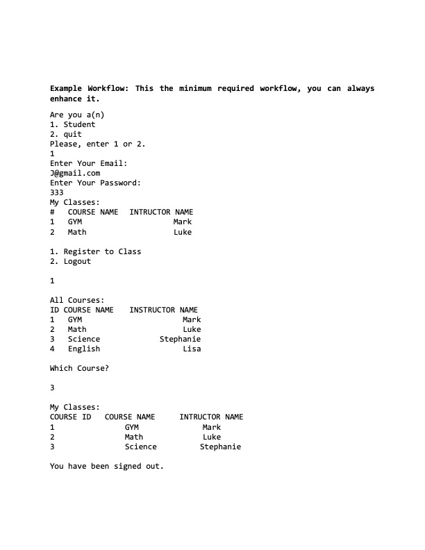
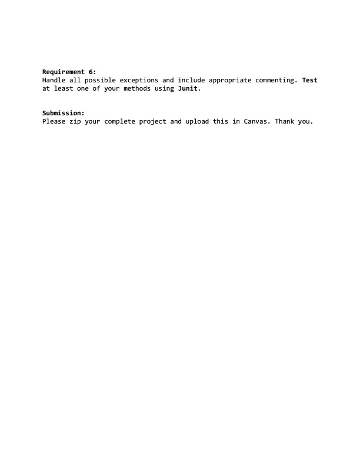

# SBA: Core Java/JPA/Junit
This is my submission for the Per Scholas skill-based assessment covering the following topics: Core Java, JPA, and JUnit

NOTES:
- 
- Seed data is auto-populated!
    - The program will drop and re-create tables first, then populate the tables with the seed data provided in the exercise.
- SMSRunner was provided as part of the exercise; but had to be modified because several variable names and methods did not match those listed in the requirements.
- Domain variables were renamed for clarity

 
Requirements:

